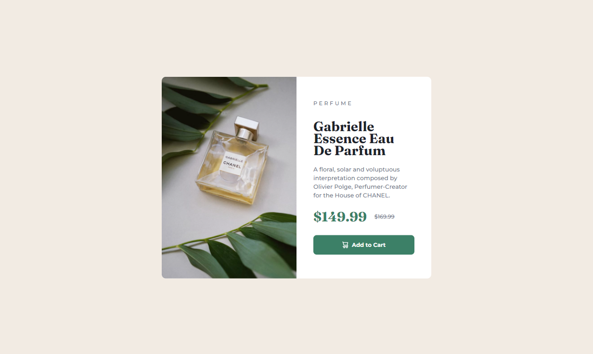

# Frontend Mentor - Product preview card component solution

This is a solution to the [Product preview card component challenge on Frontend Mentor](https://www.frontendmentor.io/challenges/product-preview-card-component-GO7UmttRfa). Frontend Mentor challenges help you improve your coding skills by building realistic projects. 

## Table of contents

- [Overview](#overview)
  - [The challenge](#the-challenge)
  - [Screenshot](#screenshot)
  - [Links](#links)
- [My process](#my-process)
  - [Built with](#built-with)
  - [What I learned](#what-i-learned)
- [Author](#author)

## Overview

### The challenge

Users should be able to:

- View the optimal layout depending on their device's screen size
- See hover and focus states for interactive elements

### Screenshot




### Links

- Solution URL: [Solution](https://github.com/melissabo94/product-preview-card)
- Live Site URL: [Live Site](https://melissabo94.github.io/product-preview-card/)

## My process

### Built with

- Semantic HTML5 markup
- CSS custom properties
- Flexbox
- CSS Grid
- Mobile-first workflow

### What I learned

```html
<article>
        <picture>
          <source media="(min-width: 640px)" srcset="./images/image-product-desktop.jpg">
          
        </picture>
</article>
```

## Author

- LinkedIn - [Melissa Borgnino](https://www.linkedin.com/in/melissa-borgnino-909712198/)
- Frontend Mentor - [@melissabo94](https://www.frontendmentor.io/profile/melissabo94)
